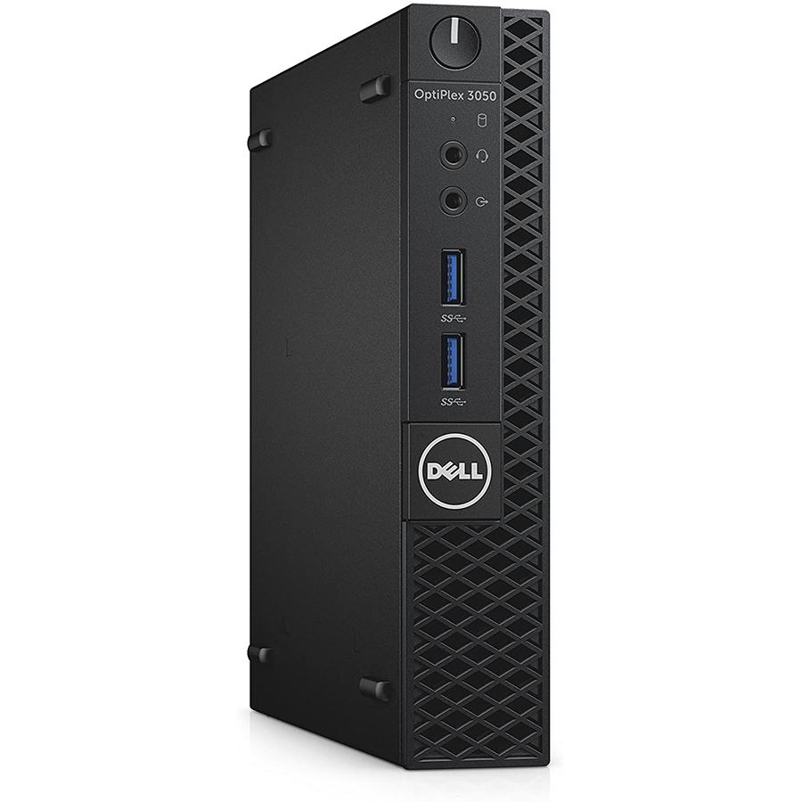
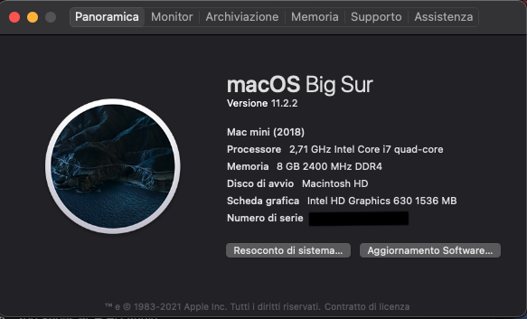
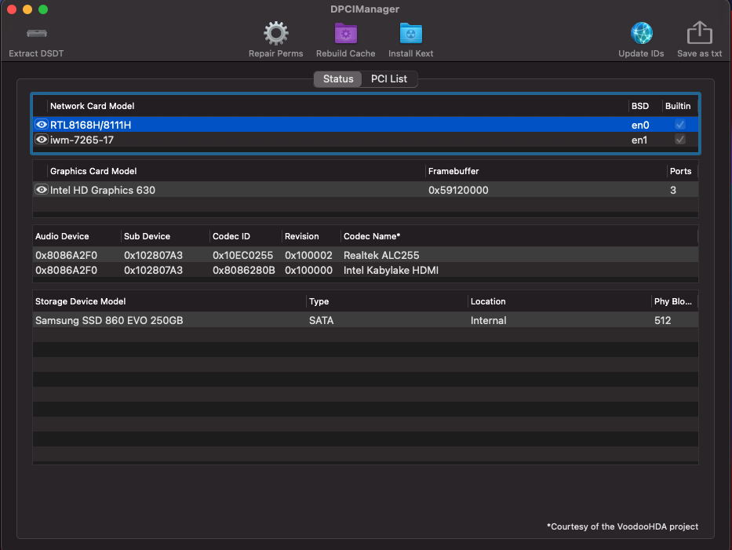
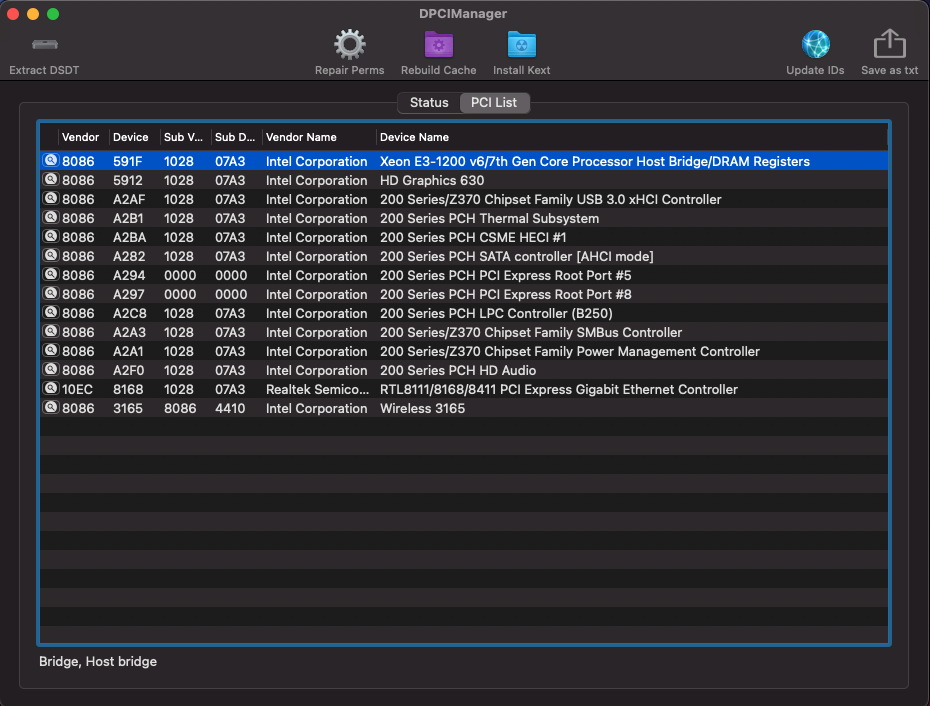

# DELL 3050 MICRO 

### Computer Spec:

| Component        | Brank                              |
| ---------------- | ---------------------------------- |
| CPU              | i5 7500T        |
| iGPU             | Intel® HD Graphics 630         |    
| Audio            | Realtek ALC255            |
| Ram              | 8GB 2133 Mhz DDR4  |            |
| Wifi             | Intel WIFI - 7265  |
| SSD             | Samsung 860 256 GB                  
| SmBios          | macmini 8,1  |   
| BootLoader       | OpenCore 0.7.1                    

### What works and What doesn't or WIP:

- [x] Intel HD 630 iGPU + HDMI AUDIO/HDMI/DP VIDEO
- [x] All USB Ports 
- [ ] SpeedStep / Sleep / Wake
- [x] Wi-Fi Intel AC 7265
- [x] NVRAM
- [x] Windows boot from OpenCore

## Peripherals  Setting 

## Bios settings
### Enable :
* SATA Operation : AHCI
* Fastboot : Thorough
* Integrated NIC : Enable

### Disable : 
* Secure Boot
* Absolute
* TPM2.0 Security On
* Intel SGX
* Enable UEFI Network Stack

### Special Config:

- Usb port mapping performed
- SSDT-Hack Essential patch

## Credits

- [Apple](https://apple.com) for macOS;
- [Acidanthera](https://github.com/acidanthera) for OpenCore and all the lovely hackintosh work.
- [Dortania](https://github.com/dortania) For their detailed guides.
- [Vins95](https://github.com/Vins95)
- [Hackintoshlifeit](https://github.com/Hackintoshlifeit)
- [Lorys89](https://github.com/Lorys89/)

# If you need help please contact us on [Telegram](https://t.me/HackintoshLife_it) 
